# 🧠 Mnemosyne

<div align="center">
<h3><em>Create Another You</em></h3>
<p><strong>Your Digital Clone That Learns How You Think</strong></p>
</div>

---

## What is Mnemosyne?

**Mnemosyne** is an AI-powered system that learns to be *you*. It records your computer activity, understands *why* you do what you do, and builds a digital twin that can act on your behalf.

!!! quote "The Dream"
    Everyone has dreamed of creating another "me" at least once.
    Another you that works while you sleep. Another you that thinks when you're tired.

## Key Features

<div class="grid cards" markdown>

-   :material-video-outline:{ .lg .middle } **Micro-Action Recording**

    ---

    Captures every mouse click, keystroke, and screen context with millisecond precision.

    [:octicons-arrow-right-24: Learn more](guide/recording.md)

-   :material-head-question:{ .lg .middle } **Curious AI**

    ---

    Unlike passive tools, Mnemosyne actively asks *"Why did you do that?"* to understand your reasoning.

    [:octicons-arrow-right-24: Learn more](guide/analysis.md)

-   :material-brain:{ .lg .middle } **Persistent Memory**

    ---

    Semantic memory that never forgets. Search your past behaviors by meaning, not keywords.

    [:octicons-arrow-right-24: Learn more](guide/memory.md)

-   :material-robot:{ .lg .middle } **Execution Agent**

    ---

    Your digital twin can take action on your behalf, with safety guards to prevent mistakes.

    [:octicons-arrow-right-24: Learn more](guide/execution.md)

</div>

## Quick Start

```bash
# Install
pip install mnemosyne

# Setup
mnemosyne setup

# Start web interface
mnemosyne web
```

Visit [http://localhost:8000](http://localhost:8000) to chat with your digital twin!

## How It Works

```mermaid
graph LR
    A[👆 Your Actions] --> B[📹 Capture]
    B --> C[🤔 Reason]
    C --> D[🧠 Memory]
    D --> E[🤖 Execute]
    E --> A
```



1. **Capture** - Record every micro-interaction
2. **Reason** - AI infers intent and asks questions
3. **Memory** - Build understanding over time
4. **Execute** - Your digital twin takes action

## Why Mnemosyne?

| Traditional Automation | Mnemosyne |
|------------------------|-----------|
| Records **what** you do | Understands **why** you do it |
| Replays fixed scripts | Adapts to new situations |
| No memory between sessions | Remembers everything forever |
| Passive tool | Actively curious AI |

## Multi-Provider LLM Support

Use the AI provider you trust:

- **OpenAI** - GPT-4, GPT-4 Turbo
- **Anthropic** - Claude 3, Claude 3.5
- **Google** - Gemini Pro, Gemini Ultra
- **Ollama** - Run locally with Llama, Mistral, etc.

## Getting Started

<div class="grid cards" markdown>

-   :material-download:{ .lg .middle } **Installation**

    [:octicons-arrow-right-24: Install Guide](getting-started/installation.md)

-   :material-rocket-launch:{ .lg .middle } **Quick Start**

    [:octicons-arrow-right-24: 5-Minute Tutorial](getting-started/quickstart.md)

-   :material-cog:{ .lg .middle } **Configuration**

    [:octicons-arrow-right-24: Config Reference](getting-started/configuration.md)

</div>

## Community

- [GitHub Issues](https://github.com/yourusername/mnemosyne/issues) - Bug reports & feature requests
- [Discussions](https://github.com/yourusername/mnemosyne/discussions) - Questions & ideas
- [Contributing Guide](contributing.md) - Help improve Mnemosyne

## License

Mnemosyne is [MIT licensed](https://github.com/yourusername/mnemosyne/blob/main/LICENSE).
